> 原文摘抄自[新浪旅游](http://travel.sina.com.cn/china/2014-11-26/1604286912.shtml)。

昙华林位于老武昌的东北角，地处城墙内的花园山北麓与螃蟹岬南麓间，有关这里的传说有两种，一说是巷内有花园，大多种植的是昙花，古时花与华是通假字，故而得名；第二种说法是巷内多住种花人，一坛一花，蔚然成林，后来“坛”讹为“昙”，遂有昙华林。现在的昙华林里虽然难觅昙花的踪迹，但街口那一片桃花开得正盛，颇为惹眼。粉色花朵掩映下的就是昙华林的招牌了。昙华林这条街并不长，只有1200米，但街边那些老建筑和文艺小店如果要细细逛来也能逛上整整一个下午。

<!-- more -->

## 文艺青年眼里的昙华林

### 大水的店

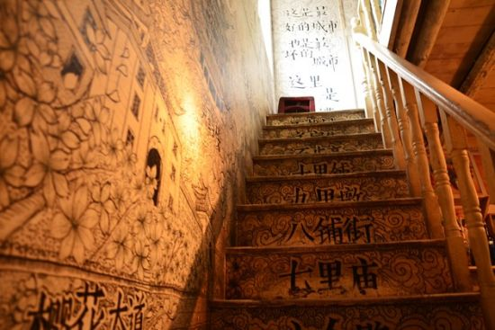

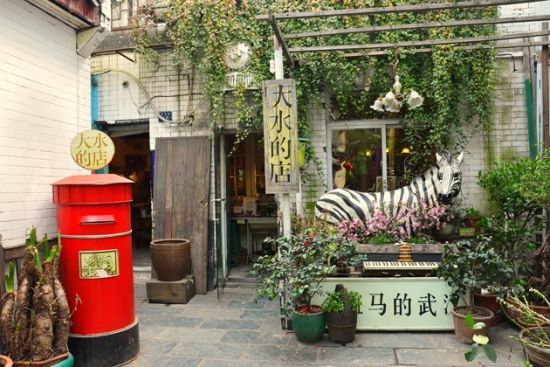

从街口往里走不久，就能看到这家昙华林最声名在外的店。老板大水不是武汉人，却对武汉了若指掌，店里乱而有序，装修充满了汉味元素，从牛皮纸上画的手绘地图，到从一到万写着武汉地名的阶梯，都能让本地人会心一笑。当然，最出名的还是门口那个写着“个斑马的武汉”的招牌。“个斑马”是一句武汉方言，不算太文明，却是许多武汉土著的口头禅，往往作为语气助词没有恶意。有专家说这个是糟粕，整改后老板把前两个字遮了起来，却没有拆除，武汉式的执拗在这里也可见一斑。这家店有两层楼，一楼卖些小玩意，二楼可以坐下来喝杯咖啡，生意很好，总是站满了人，店员大多淡淡的，不甚热情。

人均消费：25元
推荐：长岛冰茶、巧克力布朗尼
地址：昙华林56号
推荐指数：★★★★★

【贴士】人多，周末来很可能没有位置坐，不买东西一般不让拍照。老板自制的武汉手绘地图是特色，第一次来武汉可以买一份。

### 罗克慢递

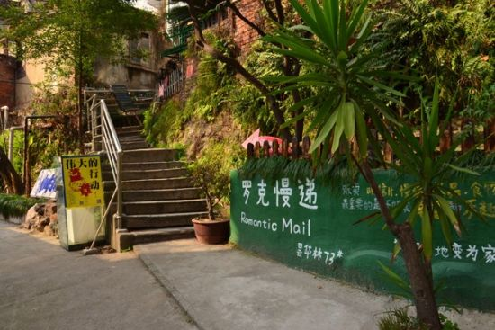

昙华林73号的这家店，经营的是给未来某个人写信的服务，而投递的时间完全由寄信人决定，可以是1年，也可以是10年，甚至更久。你可以在这里给未来写一份计划、一种期望，又或者只是记录下此时的心情，由罗克慢递的慢递员传递到你手上。除此之外，还可以“品尝”一下美丽的老板娘。从瑞典教区那个门进去，穿过一条小巷子，就会看到店铺在一个小山坡上，店里放着很多植物，二楼有个阳台，可以在上面喝咖啡晒太阳。

人均消费：27元
地址：昙华林73号
推荐指数： ★★★★☆
【贴士】慢递一年的邮寄费是25，时间越长价格越贵。

### 昙华林的光-流失光和影

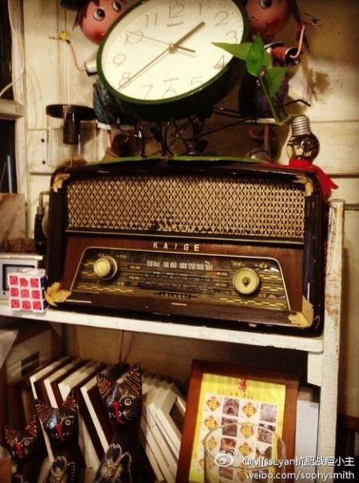

推荐理由：昙华林的光是武汉老城区超文艺的角落，在不足一米七高的小阁楼里窝一个下午，睡懒觉的猫怎么揉都不会动，还有独一无二的手绘明信片和小玩意儿。这些承载着梦想的小地方，这里是一束光，它要照亮游荡城市高楼间隙里，藏在你心里的那扇窗。每周六这家店都会放映一部文艺气息很浓的电影。

人均消费：20元
推荐：奶茶、鸡尾酒
地址：戈甲营32号1-2
推荐指数： ★★★★☆

### 老武汉眼里的昙华林

　　在昙华林因为文艺小店为人们所熟知前，在老武汉人的记忆中它是一条历经了百年风雨的老街。创办于1903的武汉第十四中，拥有68年历史的昙华林小学，1861年传入的西式教会医院仁济医院，古教堂，钱钟书之父钱基博故居……数不清的沧桑建筑都在这条街上。

### 湖北中医药大学

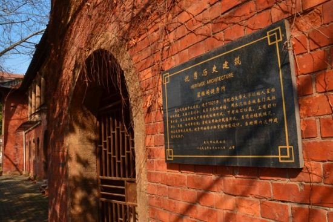

湖北中医药大学进校门右手边的“雅各健身房”，是武汉市现存最早的三座体育馆之一，是混砖木结构中西合壁二层建筑。当年杜威、侯仁之等中外著名学者都曾在此讲学，1931年武汉大水，蒋介石就在此对下面的灾民演讲。

【贴士】雅各健身房在校门右边的操场上，需要穿过食堂下去，有时会有人在操场上拍外景。

### 崇真堂

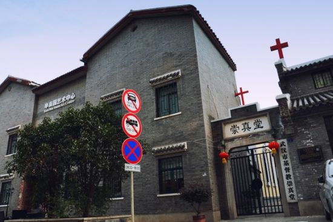

昙华林街上的老建筑很多，不经意间就会路过一两个。1864年修建的崇真堂是武昌第一座基督教堂。哥特式风格，开尖券窗，可容200人做礼拜。平时这里铁门都是紧闭的，礼拜天可能会开放。也有的老建筑被赋予了新的功能，街口桃花林后的融园就是其中之一，这里的前身是花园山牧师楼，被誉为武汉最美的咖啡馆。屋里保持着民国时期的风格，而屋外的露天咖啡座则有点星巴克的感觉，能感受到古朴与现代的交融。

### 融园咖啡

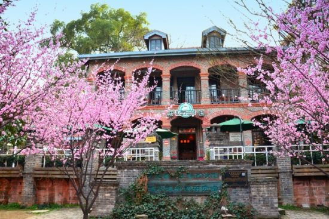

昙华林街上的老建筑很多，不经意间就会路过一两个。1864年修建的崇真堂是武昌第一座基督教堂。哥特式风格，开尖券窗，可容200人做礼拜。平时这里铁门都是紧闭的，礼拜天可能会开放。也有的老建筑被赋予了新的功能，街口桃花林后的融园就是其中之一，这里的前身是花园山牧师楼，被誉为武汉最美的咖啡馆。屋里保持着民国时期的风格，而屋外的露天咖啡座则有点星巴克的感觉，能感受到古朴与现代的交融。

人均消费：22元
推荐：提拉米苏、红豆汤圆
地址：昙华林68号
推荐指数： ★★★★☆

【贴士】融园咖啡室内没有暖气，冬天去会有点冷，屋外有一片桃花林，天气好的时候建议坐在外面。

### 汉绣

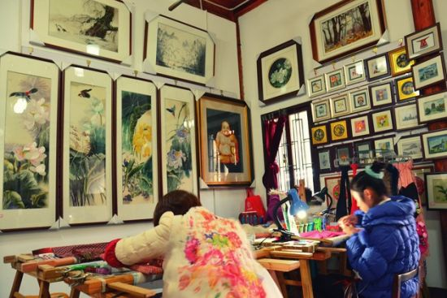

有人觉得这种文化老街都大同小异，其实昙华林也有属于自己的汉味元素。政府在昙华林建立了汉绣基地，汉绣服务社、兰绣轩、红绣坊、媚绣苑四家绣坊落户街上。走进一家家汉绣小店，看那些文静的楚女子们低头汉绣，一张张人物、动物、风景跃然纸上，你能感受到楚文化的传承。绣坊一般不大，墙上挂的是绣好的作品，都可以购买，还有一些学员在学习汉绣，看手法都已经非常专业了。

【贴士】绣坊的老板很健谈，就算不买东西也可以跟他们聊上两句。

### 花园山

位于昙华林街区腹地，东西走向，西麓临近得胜桥的全安巷，西望凤凰山，东北有螃蟹岬作为屏障；南与胭脂山相峙。每当春暖花开或金秋九月，游客络绎不绝，园内最引人注目之处要数建在山麓高处的“佳山草堂”，若登高小憩，可坐揽山川之美，可眺观江湖之胜。

### 翁守谦故居1912年

位于昙华林75号，建造于1895年前后，为二层砖门结构，原有结构及形式均有较大改变。

### 晏道刚故居

位于高家巷17号，建造于1932年。晏道刚(1889-1973)早年参加武昌起义、北伐战争。曾任国民政府委员长侍从室第一处主任，西北“剿匪”总司令部参谋长等职。后参加民革地下组织和迎接解放活动。解放后任湖北省政协委员等职。

## 吃货眼里的昙华林

### 老面馆

昙华林吃东西的地方不多，所以一家面馆就显得尤其珍贵。它开在一幢晚清全木结构的老宅里，从昙华林古街邮局旁边的小巷子进去，手边的涂鸦墙上写满了花花绿绿的字。热干面、牛肉面、米酒……大都是地道的武汉美食，在一众小清新咖啡店中，这样一家充满传统汉味的面馆也算是相当独树一帜。因为都是面食，价格不算太贵，如果逛街逛得有点累了，去吃碗武汉特色的热干面，应该挺满足的。

【贴士】吃热干面别忘了加碗米酒。

### 徐刀刀的鲜花饼

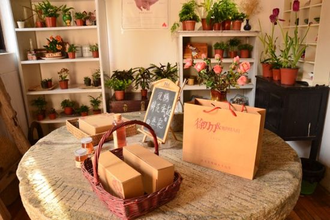

“徐刀刀和她的鲜花饼们”算是昙华林街上比较有名的店之一，店面不大，却布置得很温馨，有好多绿植。一进门就是石磨盘改成的桌子，放着包好的鲜花饼、玫瑰布丁和玫瑰汁。鲜花饼馅里有新鲜的玫瑰花瓣，据说每天只卖100个，上午10点开门营业，一般到下午1点左右，鲜花饼就卖完了。鲜花饼比较甜，适合爱吃甜食的人，如果去的时候鲜花饼卖完了，店里还有蛋挞，也是鲜花口味的。

【贴士】鲜花饼10元一个，有点贵。玫瑰汁里有蜂蜜的味道。

## 萌妹子眼里的昙华林

### 猫先生的铺子

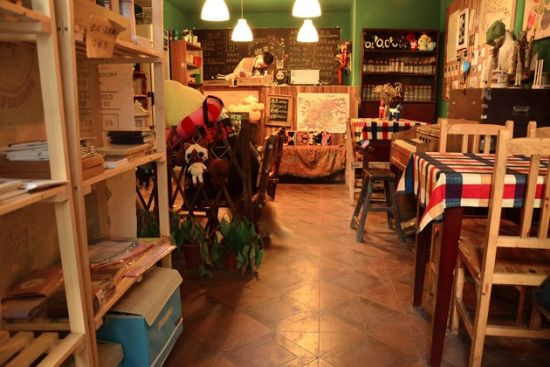

走到昙华林快街尾的地方才发现这家日系小店，看名字就能知道，这是家喵星人主题的咖啡店。帅哥老板养的几只喵星人平时自由闲散的四处撒欢，或者团成一团找个地方睡觉，心情好的时候也许会去“临幸”一下店里的客人。猫猫的照片、轻松熊、小黄人……整个店风格暖暖的，软软的，还带点宅元素，墙边的架子里有不少手办、模型、复仇者联盟的玩偶，如果是宅男带着女朋友(如果有的话)来就再合适不过了。

【贴士】店里的饮料比较常规，咖啡、奶茶、鸡尾酒都有，价格不太贵。

### 乔巴寿司

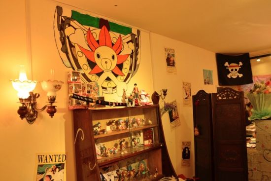

如果逛累了，想在萌萌的地方吃饭，在一条小巷子里，有一家海贼王主题的寿司店。从蓝色的大门进去，能看见门口挂着路飞的海盗旗，墙上是各种手绘、通缉令和海贼王的手办，因为叫乔巴寿司，店里的萌系元素不少，如果是海贼迷来想必会觉得十分亲切。这家店在大成路夜市上也有，昙华林这家刚开不久，店员是两个萌妹子，话不多，不过挺亲切的。推荐海贼王寿司，和芝士猪排寿司。

【贴士】大成路那家长期排队，建议来昙华林新店吃，还有位置坐。

## 交通：

地铁：轨道交通2号线，螃蟹岬站A2出口
公交：15路、108路、34路、43路、576路、584路、586路、573路、64(内环)、606路、74路、717路、729路、777路、811路(螃蟹岬站)539路、566路(解放路站)

昙华林游览小贴士：在昙华林，强烈建议步行，尽可能慢地走到每一个特色的小店，把玩每栋建筑的风格。小巷子向上之后的小山坡，是俯瞰武汉街景的一个胜地！