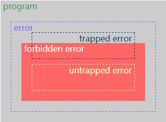

## 资料


图中的两条交叉线所形成的四块区域分别代表了

1. 强类型、动态类型检查（左上）
2. 强类型、静态类型检查（右上）
3. 弱类型、动态类型检查（左下）
4. 弱类型、静态类型检查（右下）

不同检查类型系统的语言。

那什么叫强/弱类型、动/静态类型呢？

<!-- more -->



规则：

* 红色区域外：well behaved （type soundness）
* 红色区域内：ill behaved
* 如果所有程序都是灰的，strongly typed
* 否则如果存在红色的程序，weakly typed
* 编译时排除红色程序，statically typed
* 运行时排除红色程序，dynamically typed
* 所有程序都在黄框以外，type safe

名词解释：(以下内容根据英文直译)

参考：《Type Systems》 Luca Cardelli - Microsoft Research

* Trapped error: 立即导致程序终止执行的执行错误（如除0，Java中数组越界访问）。
* Untrapped error: 出错后继续执行的执行错误（但可能出现任意行为。如C里的缓冲区溢出、Jump到错误地址）。
* Forbidden error: 语言设计时，可以定义一组forbidden behaviors. 它必须包括所有untrapped errors, 但可能包含trapped errors。
* Well behaved: 在运行时不会产生Forbidden error的程序片段。
* ill behaved：在运行时产生Forbidden error的程序片段。
* Strongly checked language: 不允许在运行时发生Forbidden error的语言（取决于Forbidden error的定义）。
* Weakly checked language: 静态检查但不提供执行错误的明确保证的语言。
* Statically checked language: 一种在编译时确定well behaved的语言。
* Dynamically checked language: 在执行过程中确定well behaved的语言。
* Type safety: 规定程序是否导致untrapped errors的属性。
* Explicitly typed language: 类型是语法的一部分的类型化语言。
* Implicitly typed language: 类型不是语法的一部分的类型化语言。

其中我们总结如下规则：

1. 动态类型与静态类型的区别在于 检测代码段正确性(不会出现ill behaved的情况) 这一过程出现在代码编译时还是在执行时。
2. 强/弱类型的区别是依靠Forbidden error进行区分的。

在javascript经常能看到如下代码：

```javascript
var name = student.getName();
```

这一行代码很好的解释了javascript是动态类型语言。因为这行代码只有在被执行的时候才能知道name的类型。根据上面的定义：在执行过程中确定well behaved的语言

> 在计算机编程中，编程语言经常被口头分类为语言的类型系统是强类型还是弱类型（松散类型）。这些术语没有一个精确的定义，但一般来说，强类型语言有更严格的输入规则，如果传递给函数的参数与期望的类型不匹配，则更可能产生错误或拒绝编译。另一方面，弱类型的语言具有更宽松的输入规则，并且可能产生不可预知的结果或者可能执行隐式类型转换。[^1]

## 总结

语言被分为强/弱类型语言，通常依据**是否可以隐式转换**进行区分；
而静态/动态类型语言通常依据类型检查这一过程在编译阶段实施（静态）还是在执行阶段实施（动态）；

另外，由于强类型语言一般需要在运行时运行一套类型检查系统，因此强类型语言的速度一般比弱类型要慢，动态类型也比静态类型慢。但是强类型，静态类型的语言写起来往往是最安全的。

[^1]: 摘自wikipedia