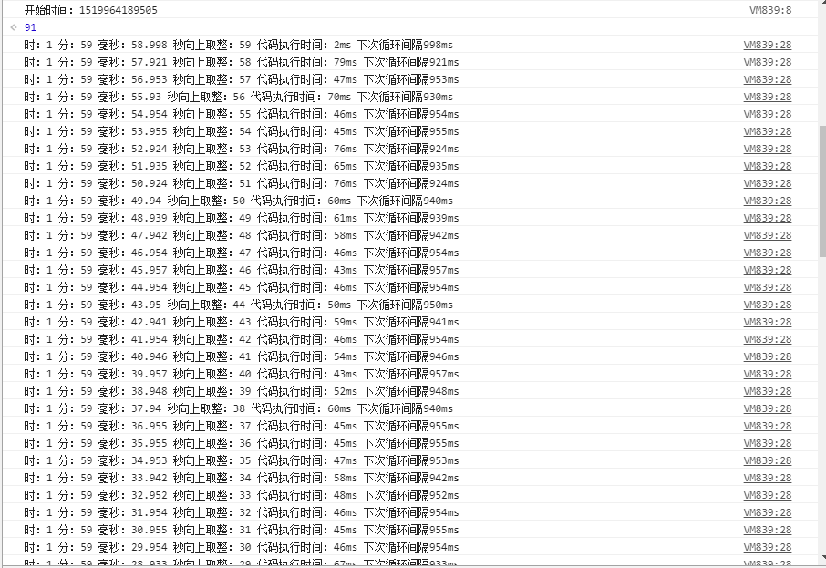

## 拜年

新年伊始，本搬砖汪先给各位老爷们拜个晚年，祝各位技术大牛们在新的一年代码功底更进一步，家庭幸福美满！

## 需求

下面进入正题：在翻阅segmentfault社区时看到某巨厂面试要求实现一个倒计时功能，之前也没有仔细实现过，趁年初来任务还没来得及分配，赶紧着手实现了一个。

## 第一版

```javascript
var period = 60*1000*60*2
var end = new Date().getTime() + period
var date = new Date(end)
var interval = 1000
var count = 0
var startTime = new Date().getTime()

console.log('开始时间：' + startTime)

function loopInner() {
  count++

  var diff = end - new Date().getTime()
  var h = Math.floor(diff / (60*1000*60))
  var hdiff = diff % (60*1000*60)
  var m = Math.floor(hdiff / (60*1000))
  var mdiff = hdiff % (60*1000)
  var s = mdiff / 1000
  var sCeil = Math.ceil(s)

  var j = 0
  while (j<100000000) { // 放大主线程代码执行时间
    j++
  }

  console.log(h + '小时', m + '分钟:', s + '秒（精确到毫秒）', sCeil + '秒（进一法）')
}

function loop() {
  loopInner() // 首先var j = 0

  if (count === 100) {
    var endTime = new Date().getTime()
    console.log('结束时间：' + endTime) // 打印开始时间
    console.log('时间差毫秒数：' + Number(endTime - startTime) + '对应秒数：' + Number(endTime - startTime) / 1000)
    console.log('计时器计算秒数：100')
  } else {
    return setTimeout(loop, interval)
  }
}

loop()
```

<!-- more -->

结果如下：


...


第一版实现我使用的是递归的setTimeout方法，原因是之前曾经看到过递归的setTimeout能避免setInterval忽视代码执行时间，而一个事件队列里只会有一个setInterval事件导致的部分setInterval事件被忽略的情况。这么执行导致的结果是每次setTimeout的时间必然会大于1000ms（1000 + 主线程代码执行消耗的时间），而当这个**主线程代码执行消耗的时间**累加起来超过1s时，就会出现跳一秒的情况。这一版实现方案的结果不尽如人意。

## 第二版

```javascript
var period = 60 * 1000 * 60 * 2
var end
var date = new Date(end)
var interval = 1000
var count = 0
var startTime = new Date().getTime()

console.log('开始时间：' + startTime)

var loop = function () {
  count++
  if (count === 100) {
    var endTime = new Date().getTime()
    console.log('结束时间：' + endTime) // 打印开始时间
    console.log('时间差毫秒数：' + Number(endTime - startTime) + '对应秒数：' + Number(endTime - startTime) / 1000)
    console.log('计时器计算秒数：100')
    return clearInterval(Itvid)
  }

  if (!end) { end = new Date().getTime() + period }
  var diff = end - new Date().getTime()
  var h = Math.floor(diff / (60 * 1000 * 60))
  var hdiff = diff % (60 * 1000 * 60)
  var m = Math.floor(hdiff / (60 * 1000))
  var mdiff = hdiff % (60 * 1000)
  var s = mdiff / (1000)
  var roundS = Math.round(s)

  var j = 0
  while (j<100000000) { // 放大主线程代码执行时间
    j++
  }

  console.log(h + '小时:', m + '分钟:', s + '秒（精确到毫秒）', roundS + '秒（四舍五入）')
}
var Itvid = setInterval(loop, interval)
```

结果如下：


...


这一版的结果比较接近正确答案，利用setInterval不等待执行代码完成就直接加入队列的特性（参考[setInterval与setTimeout的精确度问题](http://www.cnblogs.com/youxin/p/3354924.html)），再加上用Math.round方法修正js的异步方法所造成的几毫秒的误差即可。而setInterval毕竟也是浏览器的api，同样是有几毫秒的差异的。

## 第三版

这一版是我选择在第一种写法的基础上做改良：每次循环中基于此次代码执行所消耗的时间对下次循环所消耗的时间间隔做修正。

```javascript
var period = 60 * 1000 * 60 * 2
var startTime = new Date().getTime();
var count = 0
var end = new Date().getTime() + period
var interval = 1000
var currentInterval = interval

console.log('开始时间：' + startTime) // 打印开始时间

function loop() {
  count++
  var offset = new Date().getTime() - (startTime + count * interval); // 代码执行所消耗的时间
  var diff = end - new Date().getTime()
  var h = Math.floor(diff / (60 * 1000 * 60))
  var hdiff = diff % (60 * 1000 * 60)
  var m = Math.floor(hdiff / (60 * 1000))
  var mdiff = hdiff % (60 * 1000)
  var s = mdiff / (1000)
  var sCeil = Math.ceil(s)
  var sFloor = Math.floor(s)
  currentInterval = interval - offset // 得到下一次循环所消耗的时间

  var j = 0
  while (j<100000000) { // 放大主线程代码执行时间
    j++
  }

  console.log('时：'+h, '分：'+m, '毫秒：'+s, '秒向上取整：'+sCeil, '代码执行时间：'+offset+'ms', '下次循环间隔'+currentInterval+'ms') // 打印 时 分 秒 代码执行时间 下次循环间隔
  if (count === 100) {
    var endTime = new Date().getTime()
    console.log('结束时间：' + endTime) // 打印开始时间
    console.log('时间差毫秒数：' + Number(endTime - startTime) + '对应秒数：' + Number(endTime - startTime) / 1000)
    console.log('计时器计算秒数：100')
  } else {
    setTimeout(loop, currentInterval)
  }
}

setTimeout(loop, currentInterval)
```

结果如下：



...


## 暂时性结论

对于同步代码执行耗时不是过大（几十毫秒到几百毫秒之间）的情况，通过实验得到结果：

`setInterval > 修正时间间隔的递归setTimeout > 递归setTimeout`

## 疑问

1. 业务场景中是否存在同步代码执行时间超过数秒的情况？
2. 业务场景中实现倒计时的标准做法？
3. 从服务端端获取开始时间会有时间损耗（http传输的耗时），这个耗时有没有方法规避？

依然遗留这些问题存在，还请各位不吝赐教。

## 参考资料

[JS实现活动精确倒计时](https://www.xuanfengge.com/js-realizes-precise-countdown.html)
[w3.org](https://www.w3.org/TR/animation-timing/)
[javascript线程解释（setTimeout,setInterval你不知道的事）](http://www.cnblogs.com/youxin/p/3354924.html)