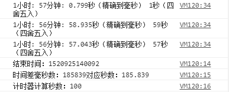

之前从浏览器的两个计时器角度出发使用了不同计时器的不同使用方法实现倒计时效果，而一个功能的优雅实现远不止于此。还要看的更远，想的更多。那么一个倒计时功能除了精确度还有什么地方需要注意？

## 补0

倒计时中的补0需求可以说十分常见了，功能要实现起来也很方便。

leftpad这个名词大家应该不会陌生，前端时间闹的沸沸扬扬的[left-pad 和 npm 的那些事](https://zhuanlan.zhihu.com/p/20707235)甚至导致了多个开源项目的崩溃，这也提醒我们作为开发者需要具备一定的硬编码能力。

leftpad这个代码块的功能就是"补位"。要实现这个功能其实很简单，简单的10来行代码就能搞定，这里给出leftpad模块的代码：

<!-- more -->

```javascript
/**
 * 字符串补位
 * @param str {String, Number} 原字符串
 * @param len {Number} 补位后总长度
 * @param ch {Number, String} 补位单位 
 */
module.exports = leftpad;
function leftpad (str, len, ch) {
  str = String(str); // 转化为字符串
  var i = -1; // 初始化索引值
  if (!ch && ch !== 0) ch = ' '; // 初始化补位符号
  len = len - str.length; // 初始化补位长度
  while (++i < len) { // 循环补位
    str = ch + str;
  }
  return str; // 返回补位后字符串
}
```

而补0操作只需要对时、分、秒这类时间单位分别使用`leftpad(timeStr, 2, 0)`即可。

## 阻塞时间超过定时器间隔

上篇文章中有遗留一个问题：倒计时的定时器时间间隔一般为1s，若同步代码执行时间需要超过1s，会出现怎样的情况？

为了放大这个问题，我们将上篇文章的第二种实现方式中，阻塞代码加大循环总量：

```javascript
while (j<(100000000 * 40)) { // 放大主线程代码执行时间（阻塞大概2秒）
  j++
}
```

除了循环代码以外，其他代码不变。调用结果：



通过结果可以发现两点：

1. setInterval并不是标准的按照定时器间隔执行的，还是会受到同步代码阻塞影响。
2. 阻塞时，setInterval会在其专属的事件队列中排队，等待前面的事件执行完。

> 如何解决堆积问题呢？因为阻塞是不可能被解决的，那么最简单的方法就是把setInterval换成setTimeout，使用一个递归来造成每隔多久执行一次的功能。当然阻塞是无法被解决的，这里的阻塞不仅仅有回调中的，还有浏览器中的方方面面的阻塞，比如用户的一些操作行为，其他定时器等外部的阻塞，所以这也就是无论我们如何做，页面开久了，定时器都会不准，或者说，变慢的根本原因。 --摘抄自知乎

对于阻塞我们没有太好的办法避免，只能从代码层面尽力保证定时器内的回调代码不要过于复杂，否则页面保持时间一长，倒计时就不准了。

## 编写优雅的倒计时功能代码

接下来从设计模式层面思考如何写一个倒计时功能。

这里找到了两段很不错的实现方案来拜读一下：

### 方案一

```javascript
var EventNotifys = [];
var Event = { // 观察者模式实例
    notify: function(eventName, data){}, // 触发
    subscribe: function (eventName, callback) {}, // 注册
    unsubscribe: function (eventName, callback) {} // 注销
};
var timer = null;

$.countDown = function(deadline,domParam){
    var that = this, // 保存上下文
        MILLS_OFFSET = 15; // 时间偏差修正指标
    function CountDown(){ // 原型构造器
        this.deadline = deadline; // 结束时间
        this.domParam = domParam; // 时间格式对应的dom元素选择器
    };
    CountDown.prototype = { // 继承辅助方法
        leftPad: function(n){},
        /**
        * 计算时差
        * @returns {{sec: string, mini: string, hour: string, day: string, month: string, year: string}}
        */
        caculate: function(){}, //
        /*刷新dom*/
        refresh: function(){}
    };
    var countDown = new CountDown(); // 新建实例
    /**
     * 启动定时器
     * @param first 是否首次进入
     */
    function startTimer(first){
        !first && Event.notify('TIMER'); // 触发
        //若是首次进入，则根据当前时间的毫秒数进行纠偏，延迟1000-当前毫秒数达到整数秒后开始更新UI
        //否则直接1秒后更新UI
        //若当前毫秒数大于MILLS_OFFSET 15，则修正延时数值与系统时间同步
        var interval = first
                       ?(1000 - mills)
                       :(mills > MILLS_OFFSET ? (1000 - mills):1000) // 定位到整秒
        mills = new Date().getMilliseconds();
        timer = setTimeout(arguments.callee, interval);
    }
    /**
     * 订阅一次事件
     */
    Event.subscribe('TIMER', countDown.refresh.bind(countDown));
    //首次初始化时启动定时器
    !timer && startTimer(true);
};

/*dom结构和样式与js分离，这里指定倒计时的dom节点信息作为配置*/
$.countDown('20160517 220451',{
    sec: $("#seconds6"),
    mini: $("#minute6"),
    hour: $("#hour6"),
    day: $("#day6"),
    month: $("#month6"),
    year: $("#year6")
});
```

这个方案使用观察者模式，将定时任务与刷新DOM的逻辑解耦了，在对时间精度的处理上，首次触发定时器的定时间隔与系统时间做校对，实现精确到整秒后开始计时。同时设定了一个代码阻塞时间的预设值，用于做循环setTimeout的时间间隔的修正。对leftpad之类的辅助方法，作者的处理是用继承的模式承载（由于这类函数式辅助函数而不是使用实例所依赖的函数，更好的解决办法是作为构造器内的私有方法并且将函数名前面加上`_`前缀）。

### 方案二

```javascript
/**
 * @author xiaojue
 * @date 20160420
 * @fileoverview 倒计时想太多版
 */
(function() {

  function timer(delay) { // 计时器类构造器
    this._queue = [];
    this.stop = false;
    this._createTimer(delay);
  }

  timer.prototype = { // 计时器类继承对象
    constructor: timer,
    _createTimer: function(delay) { // 辅助方法：创建timer
      var self = this;
      var first = true;
      (function() {
        var s = new Date();
        for (var i = 0; i < self._queue.length; i++) { // 按照栈内顺序依次执行回调
          self._queue[i]();
        }
        if (!self.stop) { // 如果没有停止计时器
          var cost = new Date() - s;
          delay = first ? delay : ((cost > delay) ? cost - delay : delay); // 计算下次定时任务时间间隔
          setTimeout(arguments.callee, delay);
        }
      })();
      first = false;
    },
    add: function(cb) {
      this._queue.push(cb);
      this.stop = false;
      return this._queue.length - 1;
    },
    remove: function(index) {
      this._queue.splice(index, 1);
      if(!this._queue.length){
        this.stop = true;
      }
    }
  };

  function TimePool(){ // 定时器池
    this._pool = {};
  }

  TimePool.prototype = {
    constructor:TimePool,
    getTimer:function(delayTime){
      var t = this._pool[delayTime];
      return t ? t : (this._pool[delayTime] = new timer(delayTime)); // 更新定时器池同时创建计时器实例
    },
    removeTimer:function(delayTime){
      if(this._pool[delayTime]){
        delete this._pool[delayTime];
      }
    }
  };

  var delayTime = 1000; // 默认时延
  var msInterval = new TimePool().getTimer(delayTime);

  function countDown(config) { // 倒计时类
    var defaultOptions = {
      fixNow: 3 * 1000,
      fixNowDate: false,
      now: new Date().valueOf(),
      template: '{d}:{h}:{m}:{s}',
      render: function(outstring) {
        console.log(outstring);
      },
      end: function() {
        console.log('the end!');
      },
      endTime: new Date().valueOf() + 5 * 1000 * 60
    };
    for (var i in defaultOptions) {
      if (defaultOptions.hasOwnProperty(i)) {
        this[i] = config[i] || defaultOptions[i];
      }
    }
    this.init();
  }

  countDown.prototype = { // 倒计时类继承对象
    constructor: countDown,
    init: function() {
      var self = this;
      if (this.fixNowDate) {
        var fix = new timer(this.fixNow);
        fix.add(function() {
          self.getNowTime(function(now) {
            self.now = now;
          });
        });
      }
      var index = msInterval.add(function() {
        self.now += delayTime;
        if (self.now >= self.endTime) {
          msInterval.remove(index);
          self.end();
        } else {
          self.render(self.getOutString());
        }
      });
    },
    getBetween: function() {
      return _formatTime(this.endTime - this.now);
    },
    getOutString: function() {
      var between = this.getBetween();
      return this.template.replace(/{(\w*)}/g, function(m, key) {
        return between.hasOwnProperty(key) ? between[key] : "";
      });
    },
    getNowTime: function(cb) {
      var xhr = new XMLHttpRequest();
      xhr.open('get', '/', true);
      xhr.onreadystatechange = function() {
        if (xhr.readyState === 3) {
          var now = xhr.getResponseHeader('Date');
          cb(new Date(now).valueOf());
          xhr.abort();
        }
      };
      xhr.send(null);
    }
  };

  function _cover(num) {
    var n = parseInt(num, 10);
    return n < 10 ? '0' + n : n;
  }

  function _formatTime(ms) {
    var s = ms / 1000,
      m = s / 60;
    return {
      d: _cover(m / 60 / 24),
      h: _cover(m / 60 % 24),
      m: _cover(m % 60),
      s: _cover(s % 60)
    };
  }

  var now = Date.now();

  new countDown({});
  new countDown({
    endTime: now + 8 * 1000
  });

})();
```

## 参考


